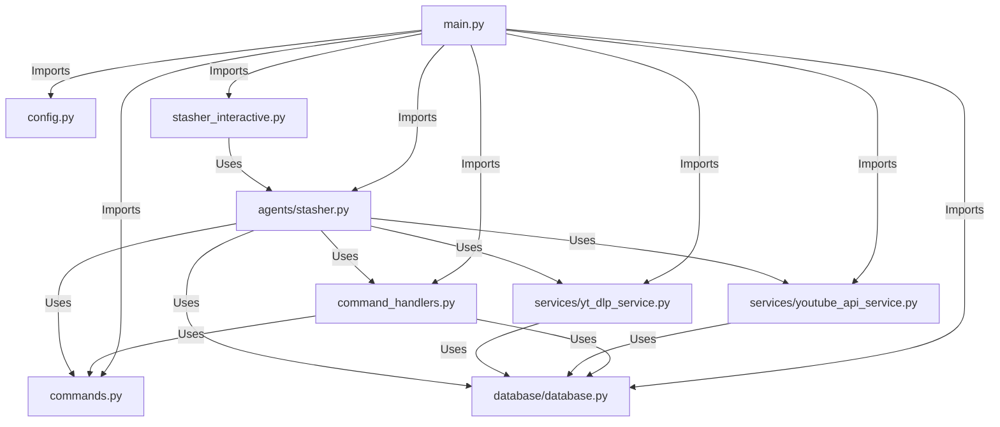

# Project Overview

This document provides an overview of the code in the project and its relation to other code components. The included Mermaid graph visualizes the relationships between different modules and files, helping to devise a comprehensive testing plan.

## Code Structure

### Main Components

1. **Command Handlers**: Handles various commands like updating playlists, stashing videos, and checking playlist deltas.
   - `command_handlers.py`
     ```python:command_handlers.py
     startLine: 1
     endLine: 71
     ```

2. **Database**: Manages database operations, including creating tables, updating playlists and videos, and handling delta jobs.
   - `database/database.py`
     ```python:database/database.py
     startLine: 1
     endLine: 218
     ```

3. **Main CLI**: Entry point for the command-line interface, defining various commands and their options.
   - `main.py`
     ```python:main.py
     startLine: 1
     endLine: 86
     ```

4. **Agents**: Contains the Stasher agent, which processes user input and determines the appropriate command to execute.
   - `agents/stasher.py`
     ```python:agents/stasher.py
     startLine: 1
     endLine: 138
     ```

5. **Commands**: Defines tools and functions for updating playlists and stashing videos.
   - `commands.py`
     ```python:commands.py
     startLine: 1
     endLine: 241
     ```

6. **Configuration**: Loads configuration settings from environment variables.
   - `config.py`
     ```python:config.py
     startLine: 1
     endLine: 11
     ```

7. **Services**: Provides services for interacting with the YouTube API and yt-dlp.
   - `services/yt_dlp_service.py`
     ```python:services/yt_dlp_service.py
     startLine: 1
     endLine: 73
     ```
   - `services/youtube_api_service.py`
     ```python:services/youtube_api_service.py
     startLine: 15
     endLine: 224
     ```

8. **Interactive Mode**: Runs the interactive agent mode for command processing.
   - `stasher_interactive.py`
     ```python:stasher_interactive.py
     startLine: 1
     endLine: 16
     ```

### Mermaid Graph




## Testing Plan

Based on the code structure and relationships, the following testing plan can be devised:

1. **Unit Tests**:
   - Test individual functions and methods in `command_handlers.py`, `database/database.py`, `commands.py`, `services/yt_dlp_service.py`, and `services/youtube_api_service.py`.
   - Mock external dependencies like YouTube API and file system operations.

2. **Integration Tests**:
   - Test the interaction between `main.py` and other modules.
   - Ensure that commands in `main.py` correctly invoke handlers in `command_handlers.py` and tools in `commands.py`.

3. **End-to-End Tests**:
   - Simulate user inputs in `stasher_interactive.py` and verify the overall workflow.
   - Test the complete flow from user input to database updates and file downloads.

4. **Configuration Tests**:
   - Verify that `config.py` correctly loads and provides configuration settings.

5. **Error Handling Tests**:
   - Ensure that appropriate error messages are returned for invalid inputs or missing tools in `command_handlers.py`.

By following this testing plan, we can ensure comprehensive coverage and robustness of the project.


---

## Adding a new tool/task flow

1. Create tool in commands
2. Create tool command handler
3. Initialize tool in stasher
4. Regiser command in stasher
5. Update prompt as needed in stasher `plan_command`